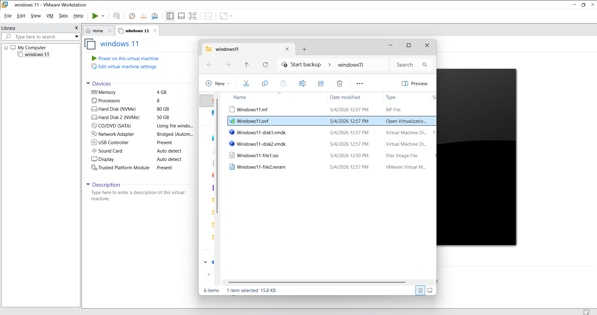
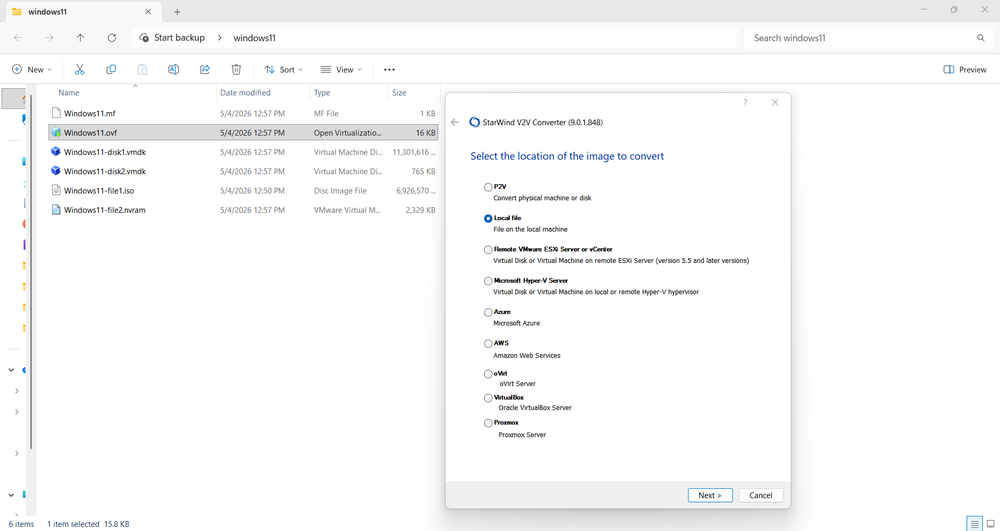
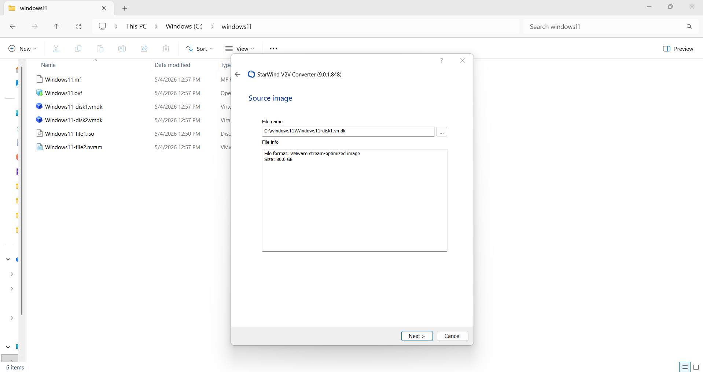
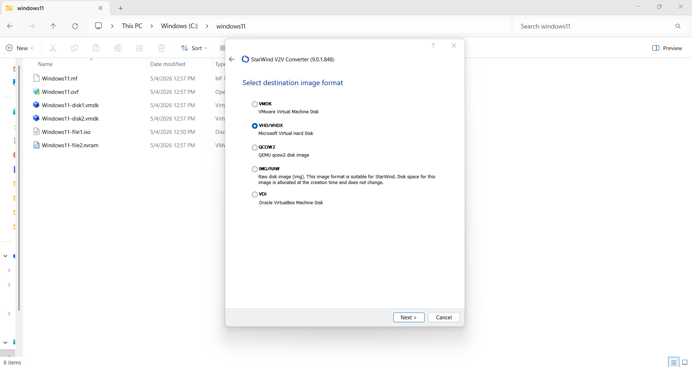
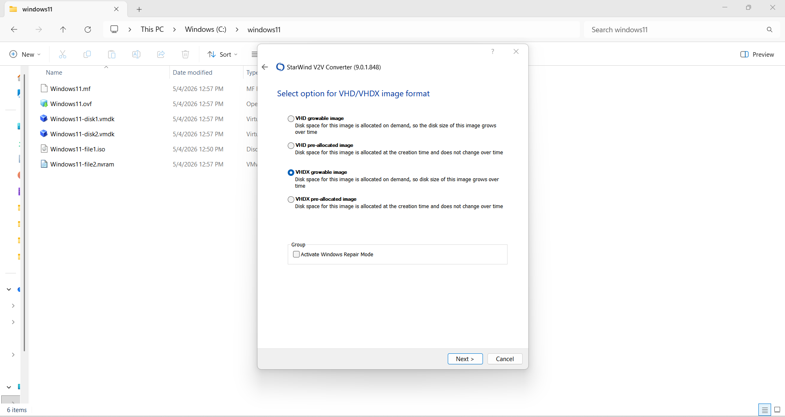
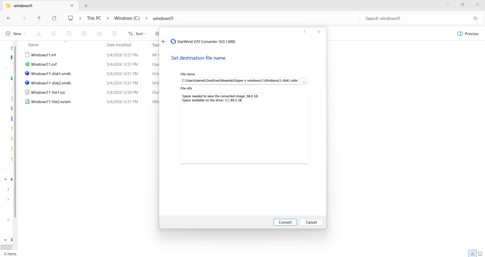
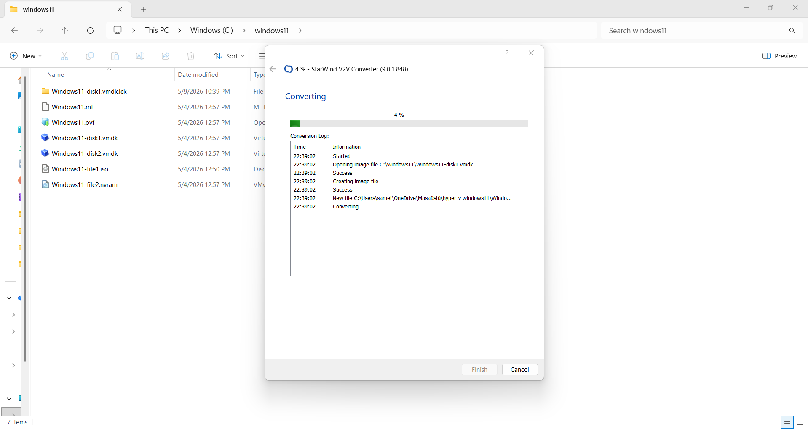
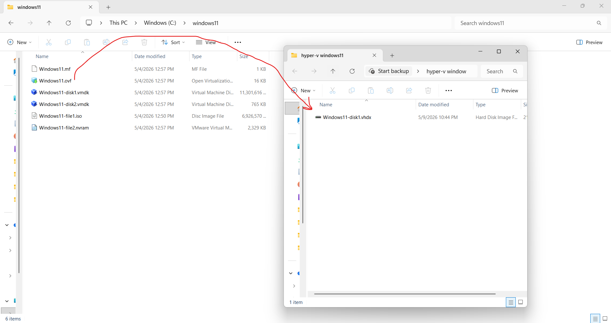
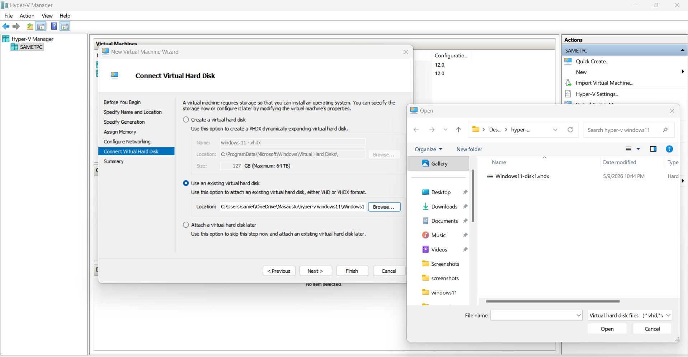
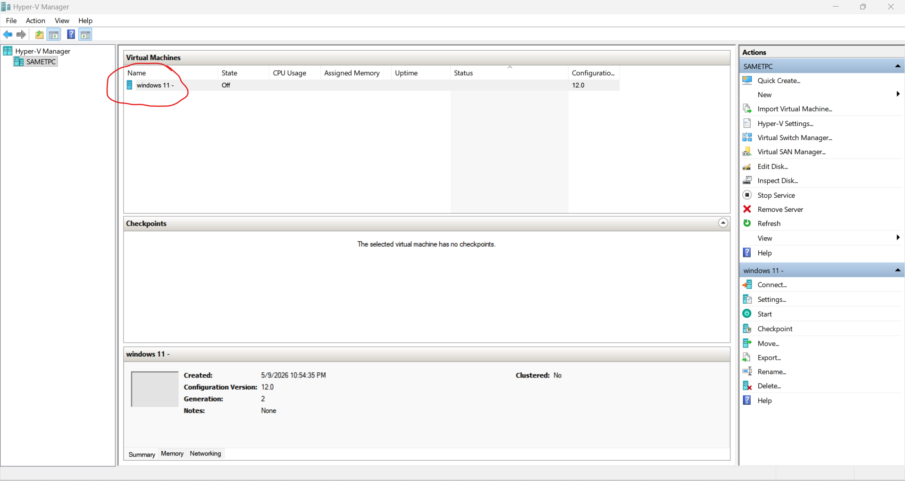

<h1>VMware to Hyper-V Virtual Machine Migration Lab</h1>

A practical lab demonstrating virtual machine migration from VMware to Hyper-V using <b>StarWind V2V Converter</b>.

<h2>📌 Project Overview</h2>

-Bu projede, VMware ortamında oluşturulan sanal makinelerin Hyper-V platformuna taşınma süreci gerçekleştirilmiştir. Geçiş işlemleri sırasında sanal disk dönüşümü için StarWind V2V Converter aracı kullanılmıştır. VMware altyapısında kullanılan VMDK disk formatı, Hyper-V'nin desteklediği VHDX formatına dönüştürülerek sistemler başarıyla migrate edilmiştir.  
  
Converter mantığında temel amaç, farklı hypervisor platformlarının kullandığı sanal disk yapılarını birbirine uyumlu hale getirmektir veya fiziksel diski platformlara uyumlu hale getirmektir. VMware ve Hyper-V farklı sanallaştırma mimarileri kullandığı için disk formatları doğrudan birbirleriyle çalışmaz. Bu projede kullanılan StarWind V2V Converter aracı, kaynak sanal diskin dosya yapısını analiz ederek verileri bozmadan hedef platformun desteklediği disk formatına dönüştürmüştür. Böylece mevcut işletim sistemi, dosyalar, uygulamalar ve yapılandırmalar korunarak sanal makine farklı bir platform üzerinde çalıştırılmıştır. Bu çalışma sayesinde farklı sanallaştırma platformları arasındaki geçiş süreçleri, sanal disk yapıları, hypervisor mimarileri ve disk conversion teknolojileri hakkında pratik deneyim kazanılmıştır.

<h2>💻 VMware Virtual Machine</h2>

-Bu aşamada, VMware platformundan Hyper-V platformuna taşınacak olan sanal makine görülmektedir. Bu taşıma işleminin amacı, sanal makineyi Hyper-V'nin sunduğu yönetim arayüzleri, sanallaştırma araçları ve altyapı özellikleri üzerinden yönetmek ve işlemleri bu platform üzerinde gerçekleştirmektir.

-At this stage, the virtual machine that will be migrated from the VMware platform to the Hyper-V platform can be seen. The purpose of this migration is to manage the virtual machine and perform operations through the management interfaces, virtualization tools, and infrastructure features provided by Hyper-V.

<h2>🔄 Converting VMDK → VHDX (StarWind V2V Converter)</h2>

<table>
<tr>
<td></td>
<td></td>
<td></td>
</tr>
<tr>
<td></td>
<td></td>
<td></td>
</tr>
</table>

-Bu bölümde StarWind V2V Converter arayüzü kullanılarak VMware'den Hyper-V'ye sanal makine taşıma işlemi gerçekleştirilmiştir. Süreçte kaynak VMDK disk dosyası seçilmiş ve hedef format olarak Hyper-V uyumlu VHDX belirlenmiştir. Araç, disk yapısını analiz ederek verilerin kayıpsız şekilde dönüştürülmesini sağlamış ve sonuç olarak Hyper-V üzerinde kullanılabilecek sanal disk dosyası oluşturulmuştur. Bu işlem, sanal makinenin Hyper-V ortamına aktarılmasını ve yönetim araçlarıyla kullanılmasını mümkün hale getirmiştir.

-In this section, the StarWind V2V Converter interface was used to migrate a virtual machine from VMware to Hyper-V. During the process, the source VMDK disk file was selected and the target format was set to Hyper-V compatible VHDX. The tool analyzed the disk structure and performed a lossless conversion of the data, resulting in a virtual disk file compatible with Hyper-V. This process enabled the virtual machine to be transferred to the Hyper-V environment and managed using its administration tools.

<h2>🚀 Transfer to Hyper-V</h2>

-Birinci görselde, VMware ortamında bulunan sanal disk (VMDK) dosyasının Hyper-V ile uyumlu hale getirilerek VHDX formatına dönüştürüldüğü gösterilmektedir. Bu dönüşüm, sanal diskin Hyper-V ortamında kullanılabilir hale gelmesini sağlar. Dönüştürülen VHDX dosyası, Hyper-V üzerinde yeni bir sanal makine oluşturulurken disk yapılandırma aşamasında sisteme eklenir. Bu sayede daha önce VMware ortamında bulunan sanal makine, oluşturulan yeni Hyper-V sanal makinesine bağlanarak başarıyla aktarılmış olur.

-In the first image, the VMware virtual disk (VMDK) is shown being converted into a Hyper-V compatible format (VHDX). This conversion enables the virtual disk to be used within the Hyper-V environment. The converted VHDX file is then added during the creation of a new virtual machine in Hyper-V, specifically at the disk configuration stage. In this way, the virtual machine previously running in the VMware environment is successfully attached to the newly created Hyper-V virtual machine and migrated.

